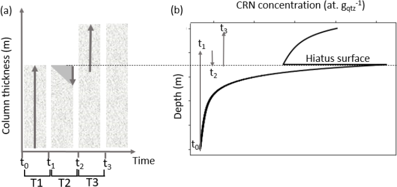

# Numerical modelling of complex CRN accumulation history

## Script files

The `src` directory contains 3 Python script files:

- `CRN_functions.py`: Core functions of the model. These functions are imported at the beginning of the scripts (if you do not modify the file structure).
- `CRN_model_one_scenario.py`: Example of depth profile optimization for one scenario, characterized by 5 time steps (see total_time, geomorpho_history and N_inh lists in the script).
- `CRN_monte_carlo.py`: Monte carlo optimization of a CRN depth profile.

## Input data

The `data` directory contains the 3 necessary `.csv` input files to model a CRN depth profile.

Measured concentration data are defined for Beryllium-10 in `obs_data_be.csv` and for Aluminium-26 in `obs_data_al.csv`. The table structure is the same for both atoms, i.e. depth (cm), observed concentration (atoms/g) and observed associated standard deviation (atoms/g).

| depth | observed_concentration | observed_sd |
| :---- | :--------------------- | :---------- |
| 197   | 934800                 | 103100      |
| 370   | 737600                 | 88500       |
| 657   | 720300                 | 122200      |

The parameters defining the range of scenarios for the Monte Carlo simulations are defined in the `params_monte_carlo.csv` file. Each line of the table represents a step of the geomorphologic history of the depth profile, i.e. aggradation, erosion or stability.



For each step, minimum and maximum values are defined for:

- the duration (yr), i.e. total_time_min and total_time_max.
- the depth (cm) of erosion (negative value) or aggradation (positive value), i.e. geomorpho_history_min and geomorpho_history_max. In the case of stability, the value is 0 for both parameters.
- the inherited CRN concentration (atoms/g), i.e. n_inh_min and n_inh_max. Value should be 0 in case of stability.

| step | total_time_min | total_time_max | geomorpho_history_min | geomorpho_history_max | n_inh_min | n_inh_max |
| :--- | :------------- | :------------- | --------------------- | --------------------- | --------- | --------- |
| 1    | 1000           | 60000          | 0                     | 500                   | 20000     | 900000    |
| 2    | 1000           | 1000           | -185                  | -685                  | 20000     | 900000    |
| 3    | 1000           | 60000          | 100                   | 250                   | 0         | 0         |
| 4    | 1000           | 1000           | -275                  | -775                  | 20000     | 900000    |
| 5    | 500000         | 1000000        | 0                     | 0                     | 0         | 0         |
| 6    | 1000           | 10000          | 100                   | 250                   | 0         | 0         |
| 7    | 1000           | 1000           | -60                   | -200                  | 90000     | 90000     |
| 8    | 12000          | 20000          | 100                   | 250                   | 0         | 0         |

Actual values in data files are those measured and used to model the As geosite profile from Vandermaelen et al. (2022).

## Workflow

### One scenario

To test your setup, first run the `CRN_model_one_scenario.py` python script. The script should normally run properly without any modifications. For a single scenario, the script runs as follows:

- The `compute_crn_depth_profile()` function computes the CRN concentrations for a given scenario, for every centimeter of the depth profile. It returns a dictionary with two entries, i.e. the modelled Aluminium-26 and Beryllium-10 concentrations over the entire depth of the profile.

```python
{"crn_conc_Al": array([64177.53956079, 63770.15870121, 63368.35409481, ...,
       71496.74567894, 71488.17187558, 71479.60931807]),
 "crn_conc_Be": array([ 9508.87326132,  9447.67712928,  9387.32019431, ...,
       10849.08979224, 10848.47401911, 10847.8586621 ])}
```

- The `get_fitted_concentrations()` function gets the fitted concentrations at the depth of observations (defined in `obs_data_*.csv` files). It returns a dictionary with two entries, i.e. the fitted Aluminium-26 and the fitted Beryllium-10 concentrations at depth of observations.

```python
{"fitted_conc_Al": array([247834.82874791, 102747.13372228,  81452.76275539]),
 "fitted_conc_Be": array([28453.37072634, 27700.96389235, 52304.81592856, 42550.02118885,
       35143.43140491, 31313.80504069, 24698.69772341, 17404.52017274,
       13849.88629079, 12550.38480446, 11896.83231942, 11688.03661138,
       11579.48702822, 11438.00328006])}
```

- The `compute_reduced_chisquare()` function returns the reduced Chi-squared value and its associated p-value for the fitting against observed concentrations. The result is returned as a dictionary.

```python
{ "chi_value": 543.9435949107092, "p_value": 0.0 }
```

The default parameters values (see `CRN_functions.py` file for further details) are defined as follows:

```python
{"atfm": 4320,
 "atn": 152,
 "atnm": 1500,
 "deep_prod_ratio": 7.4,
 "depth_values": range(0, 4000),
 "dt": 1000.0,
 "half_life_Al": 705000.0,
 "half_life_Be10": 1387000.0,
 "initial_thickness": 1500,
 "pfm": 0.0087,
 "pfm_Al": 0.0022,
 "pn": 0.9886,
 "pn_Al": 0.9732,
 "pnm": 0.0027,
 "pnm_Al": 0.0246,
 "prod_rate": 4.51,
 "rho": 2.1,
 "surf_prod_ratio": 6.75}
```

Any modification of these values can be done programmatically using the following line of code:

```python
# Define parameters of CRN modelling
parameters = define_default_parameters()

# Modify the production rate of Beryllium-10
parameters["prod_rate"] = 4.8

```

### Monte Carlo simulations

To compute Monte Carlo simulations over the ranges of parameters defined in the `params_monte_carlo.csv` file, run the `CRN_model_monte_carlo.py` Python script. This script basically iterates `n_simus` simulations of the previously described workflow. The parameter `reproduce_scenario_geosite_vandermaelen` should be set to "False" to model other profiles than the one from Vandermaelen et al. (2022).

The `compute_monte_carlo_simulations()` function returns, as a dictionary, the scenarios for which the reduced Chi-squared value is significant, i.e. the associated p-value is greater than 0.05. Below, an hypothetical result:

```python
[{'N_inh': [883944, 883944, 0, 883944, 0, 0, 90000, 0],
  'geomorpho_history': [141, -300, 115, -723, 0, 448, -90, 30],
  'total_time': [7002, 1000, 53805, 1000, 748182, 5129, 1000, 13501],
  'chi': {'chi_value': 9867.474708264172, 'p_value': 0.084}},
 {'N_inh': [929113, 929113, 0, 929113, 0, 0, 90000, 0],
  'geomorpho_history': [113, -663, 478, -420, 0, 145, -85, 25],
  'total_time': [5276, 1000, 58271, 1000, 849511, 3899, 1000, 18936]
  'chi': {'chi_value': 13733.21938832975, 'p_value': 0.056}},
 {'N_inh': [880718, 880718, 0, 880718, 0, 0, 90000, 0],
  'geomorpho_history': [6, -299, 114, -632, 0, 357, -135, 75],
  'total_time': [45307, 1000, 41334, 1000, 550432, 3832, 1000, 19145],
  'chi': {'chi_value': 12634.719002980566, 'p_value': 0.135}}]
```
